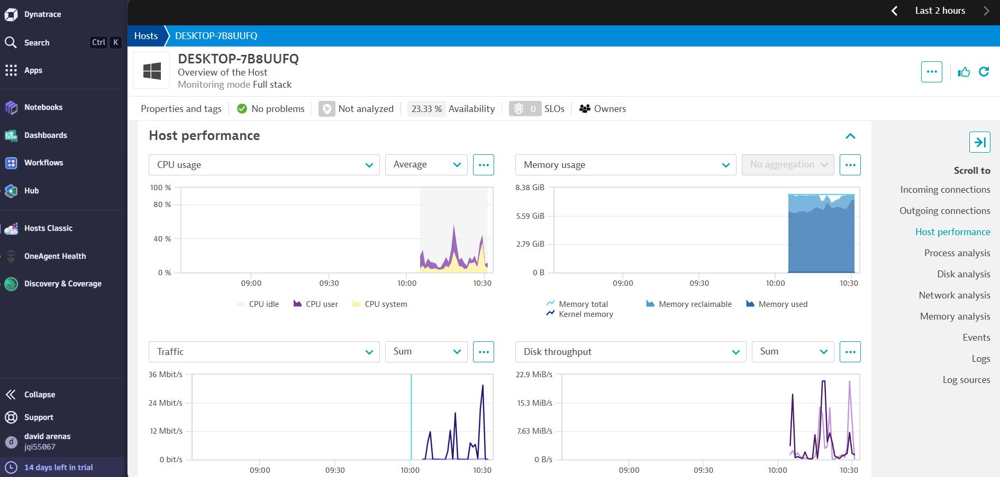
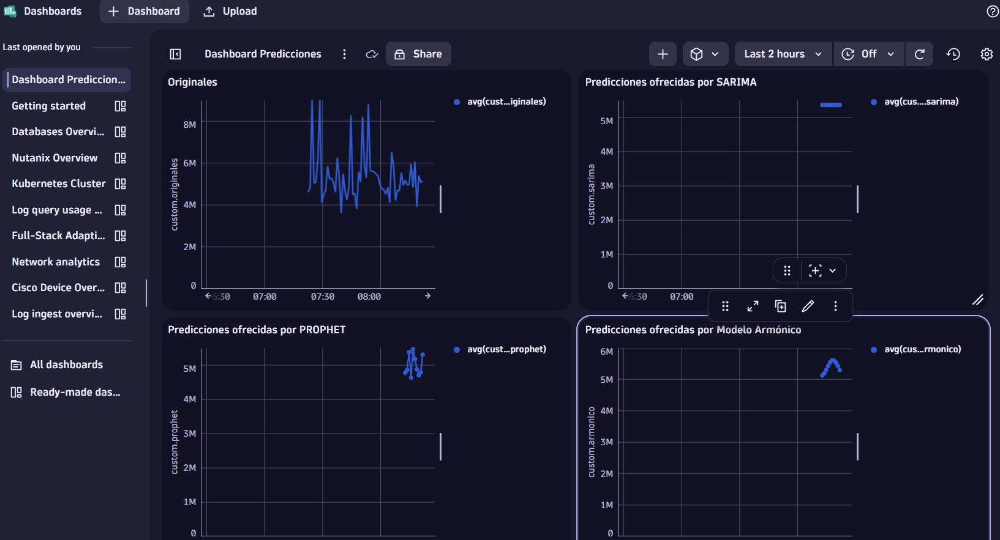

# 🔍 Monitoreo y Predicción con Prometheus, R y Ansible. Visualización en Dynatrace 

Este proyecto automatiza la recolección, análisis y predicción de métricas de [Prometheus](https://prometheus.io/) utilizando R y técnicas de modelado estadístico y de machine learning. La automatización completa del flujo de trabajo se realiza con [Ansible](https://www.ansible.com/). Además se implementa una alarma cuando la app detecta un aumento significativo en la serie temporal. Una vez se ha modelado las series temporales y se extraen las predicciones que ofrece cada modelo, se envía la información a Dynatrace via POST para su visualización. Se crea una alerta en Dynatrace para que te notifique por correo si la serie temporal supera cierto umbral. A continuaciónn se muestra un diagrama con las herramientas utilizadas. 

Todo el código funciona desde el playbook de Ansible, de esta forma, se levantan los contenedores, se descargan las librerías necesarias y se ejecuta el código de R en segundo plano. La web que despliega R está disponible en el localhost:3838, a continuación se pueden ver capturas de esta app.

Todas estas gráficas se han enviado también a dyntrace para la creación de dashboards y de alarmas.

---

