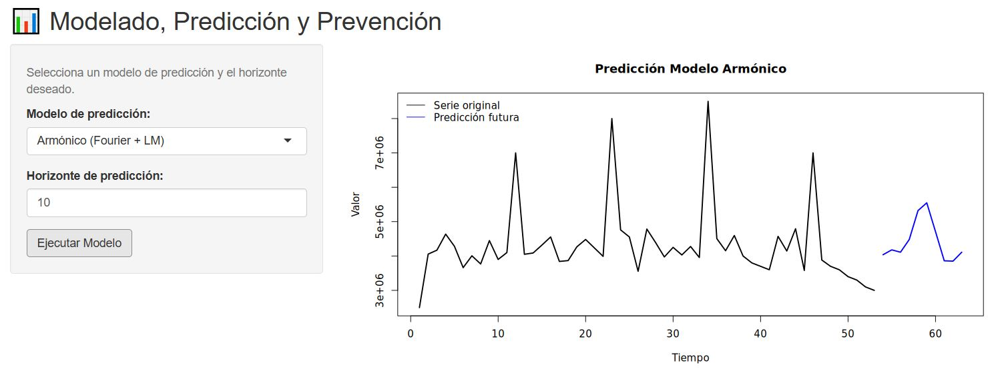
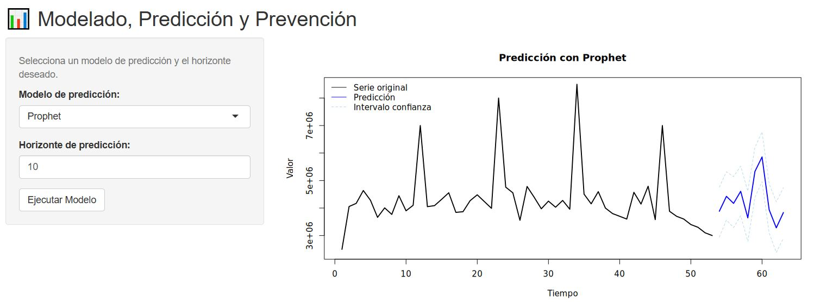
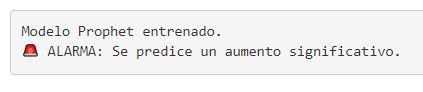

# 🔍 Monitoreo y Predicción con Prometheus, R y Ansible

Este proyecto automatiza la recolección, análisis y predicción de métricas de [Prometheus](https://prometheus.io/) utilizando R y técnicas de modelado estadístico y de machine learning. La automatización completa del flujo de trabajo se realiza con [Ansible](https://www.ansible.com/). Además se implementa una alarma cuando la app detecta un aumento significativo en la serie temporal.

---

